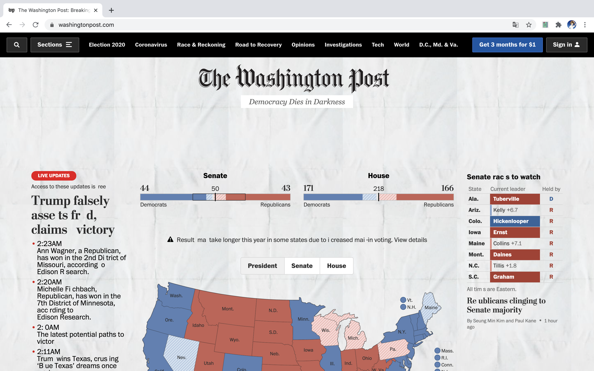
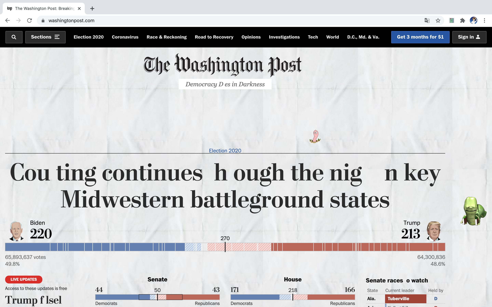
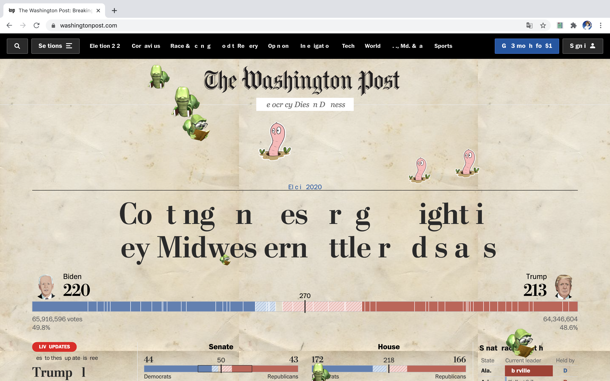
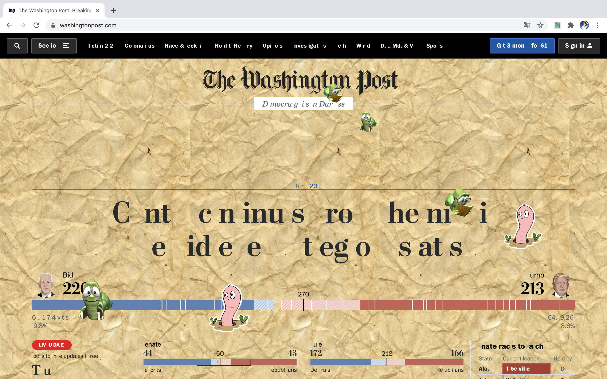

# INTRO: WEBBOOK

[Download webbook extension here!]()

How would a web page be like if it's a book? It may become crumpled, has a yellowish tinge, grow some bookworms, or blur some letters after browsing. These may be annoying since you have to treat them more carefully. You can visit a website countlessly, but you can't open a book limitlessly. It cost almost nothing to open a new tag and visit a website but cost something to open and read a physical book. Therefore, people visit websites, and dispose of them, without paying much attention to them.

Webbook, as the name implies, turns your web page into a book. Your web page would become older and older as you visit it more and more. It will be crumpled, has a yellowish tinge, grow some bookworms, or blur some letters after browsing. The payback is that you can add a bookmark to the web page. Be aware when you browsing, think twice before you open a new tab, and treat your web pages carefully!

 

# TECHNICAL CHALLENGES

1. Changing the background of all websites

It's tricky to change the background of all the websites with the same codes. When we tried to realize this function at first, we found that change the background image of the body only works with a fraction of web pages. That's because for most websites, some colored divs or other elements are covered on top of the body. To solve this problem, we find most DOM elements that may be colored and set their background color to transparent. This method works for most web pages, but if some websites use some weird colored DOM elements that we didn't cover in the code, this method would not work.

2. The missing letters

We did this by firstly scanning through most possible DOM elements that may contain texts, and getting their innerText. Then randomly pick the index of the lost letter. The number of the lost letters would depend on the length of the whole text as well as how many times the page has been visited. Also, we found that in HTML, only one space would be shown on the web page even if you type two. Therefore, we replace the letter with "\u00A0", which force it to render extra space on the page.

3. Sending a message to the newly visited web page

In our project, we need to send a message from the background script to the content script of the newly opened web page about the visit count, bookmark position, etc. However, we found that the new tab always fails to receive the message. We guessed that it may because the message was sent too fast that the page hasn't loaded. Therefore, we put the send message function inside a setTimeout function to delay the message sending. This worked on most websites, but when the website takes more than the time we set to load, the content script still can't receive the message. We tried to use the chrome.webNavigation.onCompleted API in the background script. It works but leads to some other weird bugs. Finally, we found a way that let the content script to send a message to the background script when the page is loaded. When the background script receives that message, it will then send all the information.

4. Track the visit times of each website

Before the development process, we thought it would be a hard part. However, we surprisingly found that the history API provides the visitCount information for every URL. Then, this part became much easier to track the visit times of each website.

5. Bookmark function (track window position)

The bookmark functions like this: click the bookmark button, and the popup script will send a message to background script. The background script then sends message to content script in quest for the current window position. Then the position will be stored in background script. When the website is open again, the background script will send the stored window position to the content script and the content script will direct the webpage to where the position is recorded. There're a lot of messages sending process, and keeping track of the message by using console log is crucial to avoid confusion.
